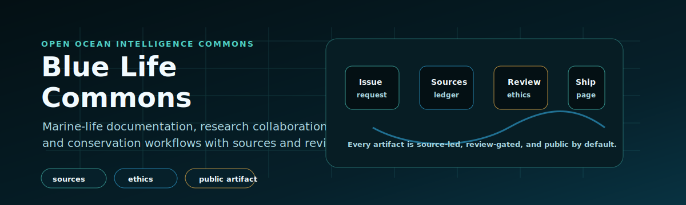

# Blue Life Commons

<p align="center">
  
</p>

<p align="center"><b>An open, reviewed, CC-BY commons of ocean intelligence — that humans and AI agents can both read from and contribute to.</b></p>

[](CATALOG.md)
[](SOURCES.md)
[](ETHICS.md)
[](AGENTS.md)
[](CONTRIBUTING.md)
[](https://creativecommons.org/licenses/by/4.0/)

Blue Life Commons turns scattered ocean knowledge into **reviewed, source-led, openly-licensed artifacts** — species guides, region briefings, field missions, dataset cards, and the MCP tooling to query them. Every artifact is cited, ethics-checked, and machine-readable. Nothing ships without a source.

An initiative by Starlight Intelligence Systems — starting with whales, dolphins, seals, sea lions, turtles, sharks, rays, and reef ecosystems.

---

## Who it's for

| You are a… | You get… |
|---|---|
| **Citizen / ocean lover** | Plain-language, sourced guides to species and places — and a way to add what you know about your stretch of coast. |
| **Researcher** | A reviewed corpus with citations carried through every artifact, plus dataset cards for the open marine APIs you already use. |
| **Developer / agent builder** | Schema-valid, machine-readable content and an [MCP server](https://github.com/frankxai/marine-mcp) that serves it `grounded or silent` — no invented facts. |
| **Educator** | Field missions and lessons you can run with students, each with safety and ethics built in. |
| **NGO / conservation org** | An open knowledge base you can build a Research-OS on, without starting from a blank page. |

---

## 90-second start

Pick the lane that matches why you're here:

| I want to… | Start with |
|---|---|
| Browse what's already published | [`CATALOG.md`](CATALOG.md) — the living index |
| Contribute a species page, region briefing, mission, or dataset card | [`CONTRIBUTING.md`](CONTRIBUTING.md) |
| Work the commons with a coding agent | [`AGENTS.md`](AGENTS.md) |
| Understand the citation bar | [`SOURCES.md`](SOURCES.md) |
| Understand the wildlife-interaction rules | [`ETHICS.md`](ETHICS.md) |
| Understand *why* this exists and how it stays free | [`STRATEGY.md`](STRATEGY.md) |

Run the checks locally before you open a PR:

```bash
python scripts/build_catalog.py --check    # is the catalog index current?
python scripts/validate_artifacts.py        # do artifacts match the schema?
python scripts/lint_content.py              # style + link checks
```

---

## What's inside

```
blue-life-commons
├── content/              # versioned knowledge
│   ├── species/          # species guilds: cetaceans, pinnipeds, turtles, sharks-rays, reefs, sirenians
│   └── regions/          # regional ocean briefings
├── missions/             # citizen-science + travel field missions
├── schema/               # the metadata schema that connects every artifact
├── governance/           # governance stages, funding architecture, impact records
├── agent/                # role briefs for coding agents working the commons
├── scripts/              # catalog build + artifact validation + content lint
├── docs/                 # contributor onboarding, researcher guides
└── .github/              # issue templates, PR template, CI validation
```

[`CATALOG.md`](CATALOG.md) is auto-generated from `content/` — it indexes every published artifact by type. Regenerate it with `python scripts/build_catalog.py`; CI fails if it drifts out of date.

---

## How to contribute

Every contribution is an **artifact**: a reviewed, sourced, schema-valid file that flows to the website, map, and impact ledger with your credit attached.

1. Read [`CONTRIBUTING.md`](CONTRIBUTING.md) and pick an artifact class — species page, region briefing, field mission, dataset card, MCP connector, translation, or lesson.
2. Open or find an issue using the templates in [`.github/ISSUE_TEMPLATE/`](.github/ISSUE_TEMPLATE/).
3. Write your artifact against the metadata schema in [`schema/artifact-schema.md`](schema/artifact-schema.md).
4. Open a pull request. Review checks three things: **sources, ethics, and clarity**.
5. On merge, your artifact is published and credited.

New contributors and coding agents both start the same way — with a source. If you can't cite it, it doesn't go in.

### Working with a coding agent

Two companion repos let Claude Code, Codex, or Cursor work the commons safely:

- **[`marine-mcp`](https://github.com/frankxai/marine-mcp)** — a review-gated MCP server that serves this corpus to agents. It returns a curated body *as fact* only when the artifact is review-approved, and carries `sources[]` through every response (`grounded or silent`).
- **[`marine-agent-skills`](https://github.com/frankxai/marine-agent-skills)** — a Claude Code skill pack (`/species-page`, `/field-mission`, `/ethics-check`, `/source-verify`, `/validate-artifact`, `/open-artifact-pr`) so a contribution is schema-valid, sourced, and ethics-checked *before* the PR.

Start at [`AGENTS.md`](AGENTS.md).

---

## The standards that never bend

These are **standards, not popularity contests** — never subject to community vote or commercial pressure:

- **Scientific truth and citation** — every claim traces to a real, tiered source. See [`SOURCES.md`](SOURCES.md).
- **Animal safety and wildlife-interaction ethics** — no content that encourages harmful approach or disturbance. See [`ETHICS.md`](ETHICS.md).
- **Expert review** for science-sensitive content before it is marked `published`.

A guardian, a guide, or a mission is `grounded or silent`: it states a fact only if that fact traces to a reviewed artifact or a cited source. No invented facts, no anthropomorphic guesses.

---

## Why it exists (and how it stays free)

Blue Life Commons is the **trust layer** of a three-layer system: the free, reviewed knowledge base; the open-source software that acts on it ([`ocean-intelligence-system`](https://github.com/frankxai/ocean-intelligence-system)); and the commercial layer that implements and distributes it. The commons stays free forever — sustainability comes from the work *around* the knowledge, never from gating it.

The full picture — the three layers, the operating model, the commercial boundary, and how impact compounds — is in **[`STRATEGY.md`](STRATEGY.md)**. How this repo fits the wider FrankX ecosystem is in [`ECOSYSTEM.md`](ECOSYSTEM.md).

---

## License

Content is licensed [CC-BY-4.0](https://creativecommons.org/licenses/by/4.0/) unless an artifact's metadata states otherwise. Code is open source. Cite the commons, build on it, and send your improvements back.
