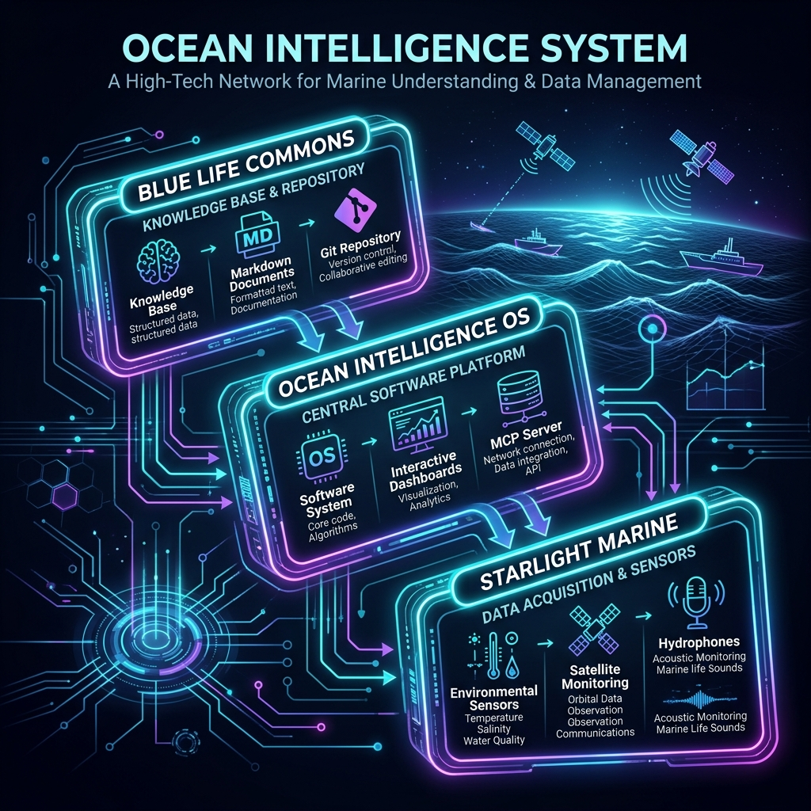

# Blue Life Commons



Blue Life Commons is an open-source **Ocean Intelligence commons** where citizens, researchers, developers, educators, travelers, and conservation organizations turn ocean curiosity into useful artifacts: species guides, field missions, maps, research summaries, datasets, notebooks, MCP tools, films, and local action systems.

An initiative by Starlight Intelligence Systems — starting with whales, dolphins, seals, sea lions, turtles, sharks, rays, and reef ecosystems.

---

## The hard rule

> Every conversation becomes an issue. Every issue becomes an artifact. Every artifact becomes public knowledge, partner leverage, or funded impact.

And its corollary:

> Discord discusses. GitHub decides. Website publishes. Ledger records.

---

## The three-layer system

| Layer | Surface | Role |
|---|---|---|
| **Blue Life Commons** (this project) | Public-good knowledge + open-source workflows + impact ledger | Creates trust |
| **Ocean Intelligence OS** | Productized software + agent systems + dashboards + partner portals | Creates continuity |
| **Starlight Marine Intelligence Systems** | Business / implementation / media / institutional adoption | Creates reach |

The commons stays free. The business sells speed, implementation, design, integration, and institutional reliability — never access to ocean knowledge.

---

## Repository structure

```
blue-life-commons
├── content/              # species, regions, guides — versioned knowledge
│   ├── species/          # species guilds: cetaceans, pinnipeds, turtles, sharks-rays, reefs
│   ├── regions/          # regional ocean briefings (e.g., Monterey Bay)
│   ├── research/         # research summaries (e.g., passive acoustic monitoring)
│   └── partners/         # partner profiles (e.g., PRNSA cooperative association)
├── missions/             # citizen science + travel field missions
├── schema/               # the metadata schema that connects every artifact
├── agent/                # agent harness: role briefs for coding agents
├── governance/           # funding architecture, governance stages, impact records
├── docs/                 # contributor onboarding, researcher guides
└── .github/              # issue templates, PR template, validation workflows
```

---

## Seeded Artifacts Registry

All content files carry machine-readable YAML frontmatter conforming to [schema/artifact-schema.yaml](schema/artifact-schema.yaml) and are continuously validated:

| Artifact ID | Class | Scope | Scientific/Focus Topic | Status |
|---|---|---|---|---|
| `humpback-whale` | `species-page` | Cetaceans | *Megaptera novaeangliae* | needs-expert-review |
| `harbor-seal` | `species-page` | Pinnipeds | *Phoca vitulina* | needs-expert-review |
| `green-sea-turtle` | `species-page` | Turtles | *Chelonia mydas* | needs-expert-review |
| `great-white-shark` | `species-page` | Sharks-Rays | *Carcharodon carcharias* | needs-expert-review |
| `staghorn-coral` | `species-page` | Reefs | *Acropora cervicornis* | needs-expert-review |
| `california-seal-monitoring-001` | `field-mission` | Pinnipeds | Harbor Seal Beach Monitoring (NOAA Proximity Rules) | needs-expert-review |
| `monterey-bay` | `region-briefing` | Region | Monterey Bay marine ecosystems, sanctuary rules | needs-expert-review |
| `acoustic-monitoring-2026` | `research-summary` | Research | Passive Acoustic Monitoring arrays, whale migrations | needs-expert-review |
| `point-reyes-association` | `partner-profile` | Partner | Point Reyes National Seashore Association | needs-expert-review |

---

## Agentic Interface (MCP Tooling)

This repository is **agent-native by default**. By cloning the companion [ocean-intelligence-system](../ocean-intelligence-system), AI agents can launch a local Model Context Protocol (MCP) server that connects directly to this repository's files. 

Agents can call tools to query the commons:
- `get_species_list`: Lists all species profiles.
- `get_species_details`: Extracts scientific taxonomy, text, and citations for an ID.
- `get_active_missions`: Filters active citizen-science tasks by region.

---

## Local CI Validation

Run validation checks on all artifacts:
```bash
python scripts/validate_artifacts.py
```

---

## License

Content is licensed [CC-BY-4.0](https://creativecommons.org/licenses/by/4.0/) unless an artifact's metadata states otherwise. Code is open source.
