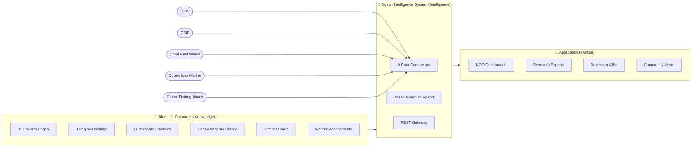

# Blue Life Commons
> The open knowledge layer for ocean intelligence — a living commons for species science, regional ecology, sustainable practices, and ocean wisdom.

---

## What is Blue Life Commons?

The Blue Life Commons is the open knowledge layer of the ocean intelligence ecosystem. Every artifact — species page, regional briefing, welfare assessment, sustainable practice, or dataset card — is sourced from peer-reviewed literature and primary databases, validated against a strict schema, reviewed through an ethics gate, and published under CC-BY-4.0 so anyone can use, remix, and build on it without restriction.

This commons feeds the Ocean Intelligence System (OIS), which runs live Guardian agents watching real ecosystems in near real-time: reef bleaching events, stranding networks, fishing pressure anomalies, species population shifts. The knowledge layer and the intelligence layer are intentionally separate: knowledge stays open and non-commercial forever; intelligence applications are built on top.

Think of it as the Wikipedia layer for ocean science — except every article is schema-validated, every claim carries a source tier, every species page connects to a live data connector, and every contribution runs through a science + ethics review before merge. The goal: a single, trusted, freely reusable body of ocean knowledge that NGOs can cite in grant applications, researchers can use as a synthesis starting point, creators can draw on for storytelling, and developers can query programmatically.

---

## Three-Layer Architecture

**Layer 1 — Knowledge (this repo):** 58+ peer-reviewed, schema-validated artifacts. The canonical reference layer. CC-BY-4.0. Never paywalled.

**Layer 2 — Intelligence ([Ocean Intelligence System](https://github.com/frankxai/ocean-intelligence-system)):** 9 live data connectors, Guardian agent framework, REST gateway. Turns static knowledge into live situational awareness.

**Layer 3 — Action (Applications):** NGO dashboards, research exports, developer APIs, community alert subscriptions. Built by the community on top of layers 1 and 2.

---

## Five Numbers Every Ocean Advocate Should Know

> These are not projections. They are current measurements.

| # | Metric | Value | Threshold |
|---|--------|-------|-----------|
| 1 | Ocean temperature above pre-industrial (2026) | **+1.1 °C** | Reefs effectively gone at +2.0 °C |
| 2 | Surface ocean pH | **8.08** | Down from 8.18; shell-forming organisms fail below 7.8 |
| 3 | Oxygen-depleted dead zones | **700,000 km²** | Growing ~2% per year |
| 4 | Global coral coverage lost since 1950 | **50%** | Bleaching events now annual at current warming |
| 5 | Ocean area under formal protection | **8%** | 30% needed by 2030 (30×30 target) |

---

## Who This Serves

| Persona | What they find here | Where to start |
|---------|---------------------|----------------|
| **NGOs & Conservation Orgs** | Species threat data, welfare assessments, claim verification, partner profiles | [`content/welfare/`](content/welfare/) |
| **Researchers** | Dataset cards, species trait data, research summaries, connector access | [`content/research/`](content/research/) |
| **Creators & Journalists** | Region briefings, species stories, visual data, shareable metrics | [`content/regions/`](content/regions/) |
| **App Developers** | Schema documentation, REST API access via OIS | [`docs/personas/developer-guide.md`](docs/personas/developer-guide.md) |
| **Agentic Developers** | MCP server, Claude Code skills pack | [marine-mcp](https://github.com/frankxai/marine-mcp) · [marine-agent-skills](https://github.com/frankxai/marine-agent-skills) |
| **Ocean Communities** | Sustainable practices, local wisdom, stranding resources, citizen science | [`content/practices/`](content/practices/) |

---

## Artifact Catalog

> Full index: [`CATALOG.md`](CATALOG.md) — regenerate with `python scripts/build_catalog.py`

### Species Pages (31)
Cetaceans · Sharks · Sea Turtles · Corals · Kelp & Seagrass · Sirenians — each page includes taxonomy, IUCN status, range, threats, conservation status, and connection to live OIS connectors.

### Regional Briefings (8)
Antarctic Ocean · Azores · Galápagos · Great Barrier Reef · Monterey Bay · Ningaloo Reef · Salish Sea · Wadden Sea — ecosystem overview, key species, threat profile, conservation programs, and Guardian agent coverage.

### Welfare Assessments (4)
In-depth welfare status reports for:
- Hawaiian Monk Seal *(Neomonachus schauinslandi)*
- North Atlantic Right Whale *(Eubalaena glacialis)*
- Southern Resident Orca *(Orcinus orca)*
- Vaquita *(Phocoena sinus)*

### Dataset Cards (6)
Structured provenance, access instructions, and quality notes for: NOAA Coral Reef Watch · GBIF · iNaturalist · OBIS · Protected Planet · WoRMS

### Partner Profiles (5)
Mission Blue · Olive Ridley Project · Point Reyes National Seashore · Reef Check · Whale and Dolphin Conservation

### Field Missions (2)
Harbor Seal Monitoring Protocol · Whale Shark Observation Standards

### Research Summaries (2)
Cetacean Acoustic Monitoring Review · Ocean Governance Landscape Analysis

### Sustainable Practices Library
Fisheries · Coastal Development · Tourism & Diving · Aquaculture · Shipping & Ports — evidence-graded practices with sourcing.

### Ocean Wisdom Library *(new)*
Curated wisdom from ocean communities, indigenous knowledge holders, and marine researchers — contextualized and source-attributed.

---

## Governance & Standards

Three documents govern every artifact in this commons. They are not subject to community vote:

| Document | What it governs |
|----------|----------------|
| [`ETHICS.md`](ETHICS.md) | Animal safety, non-exploitation, wildlife interaction rules |
| [`SOURCES.md`](SOURCES.md) | Tier 1 (peer-reviewed) / Tier 2 (institutional) / Tier 3 (community) sourcing standards |
| [`schema/artifact-schema.yaml`](schema/artifact-schema.yaml) | Machine-readable schema every artifact must pass |

Every PR triggers: CI schema validation → ethics review gate → science review gate → merge.

---

## Connected Repositories

| Repo | Layer | Purpose |
|------|-------|---------|
| [**ocean-intelligence-system**](https://github.com/frankxai/ocean-intelligence-system) | Intelligence | 9 live connectors, Guardian agents, REST gateway |
| [**marine-mcp**](https://github.com/frankxai/marine-mcp) | Agent Interface | TypeScript MCP server — `claude mcp add marine -- npx @frankxai/marine-mcp` |
| [**marine-agent-skills**](https://github.com/frankxai/marine-agent-skills) | Agent Interface | Claude Code skills pack for contributing and building |

Full ecosystem map: [`ECOSYSTEM_MAP.md`](ECOSYSTEM_MAP.md)

---

## Contributing

All contributions are CC-BY-4.0. Any PR triggers automated schema validation, an ethics review pass, and a science review gate before merge.

1. Read [`CONTRIBUTING.md`](CONTRIBUTING.md) and pick an artifact class.
2. Open or find an issue via `.github/ISSUE_TEMPLATE/`.
3. Create your artifact using [`schema/artifact-schema.yaml`](schema/artifact-schema.yaml).
4. Open a pull request — reviews check **sources, ethics, and clarity**.
5. On merge, your artifact flows to the website, map, and impact ledger with your credit attached.

Using a coding agent? Start at [`AGENTS.md`](AGENTS.md). Skills at [marine-agent-skills](https://github.com/frankxai/marine-agent-skills).

---

## License

Content: [CC-BY-4.0](https://creativecommons.org/licenses/by/4.0/) — use it, remix it, build on it, with attribution. All source citations are preserved in artifact metadata. Code: MIT.

---

*Blue Life Commons is an initiative of [Starlight Intelligence Systems](https://github.com/frankxai/Starlight-Intelligence-System). Built on the Starlight Intelligence Protocol (SIP). The commons stays free. Always.*
